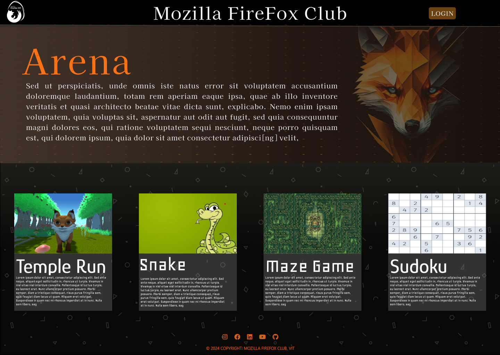

# MFC Arena Portal UI

## Overview
This project is a static frontend implementation of the **Arena portal interface** designed for the **Mozilla Firefox Club, VIT**.

The UI was originally designed in **Figma**, and this repository contains a simple **HTML and CSS implementation** created to replicate that design. The fully functional version of the platform was later developed and deployed by the **technical team of the club**.

## Technologies Used
- HTML5
- CSS3
- Flexbox

## Implementation
Includes:
- Navigation bar with club branding
- Hero/Banner section
- Game cards representing different games
- Footer with social media links